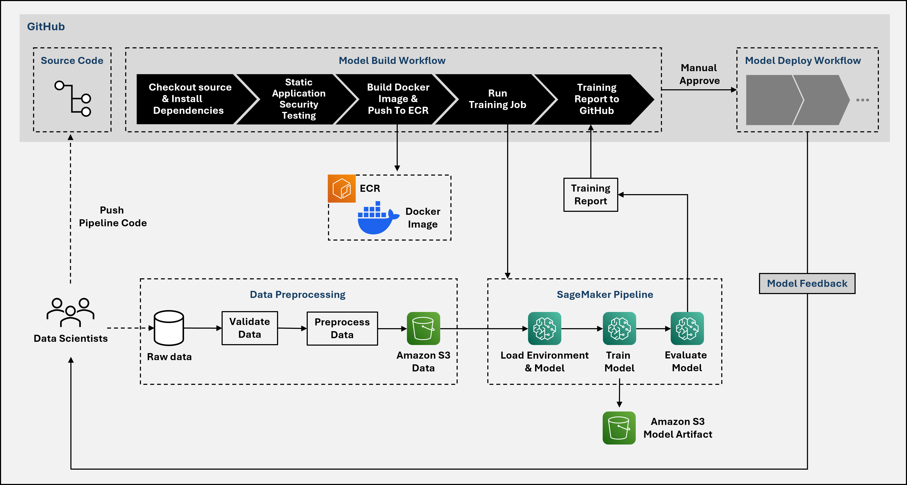
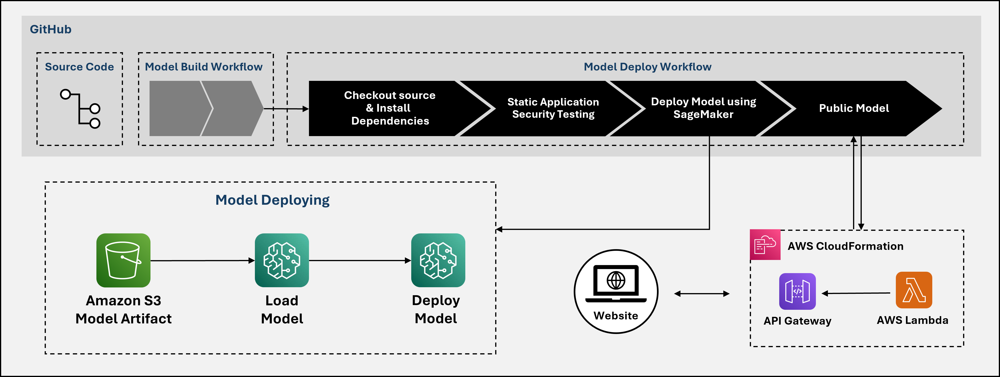

<p align="center">
  <a href="https://www.uit.edu.vn/"></a>

<h2 align="center"><b>NT548.P21 - Công nghệ DevOps và Ứng dụng</b></h2>

---

# MLOps: Tự Động Hóa Phân Tích Cảm Xúc với SageMaker, GitHub Actions và CloudFormation

Dự án này thể hiện việc áp dụng các nguyên tắc **MLOps** để tự động hóa triển khai một mô hình phân tích cảm xúc cho các đánh giá phim. Dự án sử dụng **Amazon SageMaker** để huấn luyện và triển khai mô hình, **GitHub Actions** để thực hiện tích hợp và triển khai liên tục (CI/CD), cùng với **AWS CloudFormation** để quản lý hạ tầng. Đây là sản phẩm của nhóm trong môn học **Công nghệ DevOps và Ứng dụng (NT548.P21)** tại Trường Đại học Công nghệ Thông tin, Đại học Quốc gia Thành phố Hồ Chí Minh.

---

## Mục Lục

- [Tổng Quan Dự Án](#tổng-quan-dự-án)
- [Công Nghệ Sử Dụng](#công-nghệ-sử-dụng)
- [Pipeline Dự Án](#pipeline-dự-án)
- [Hướng Dẫn Cài Đặt](#hướng-dẫn-cài-đặt)
- [Cách Sử Dụng](#cách-sử-dụng)
- [Chi Tiết Workflow](#chi-tiết-workflow)
- [Cấu Trúc Dự Án](#cấu-trúc-dự-án)
- [Lời Cảm Ơn](#lời-cảm-ơn)

---

## Tổng Quan Dự Án

Trong thời đại số, các nền tảng trực tuyến tạo ra lượng lớn dữ liệu văn bản, chẳng hạn như đánh giá phim, phản ánh ý kiến và cảm xúc của khán giả. Việc phân tích thủ công những dữ liệu này rất tốn thời gian và dễ xảy ra sai sót. Dự án này giải quyết vấn đề đó bằng cách tự động hóa phân tích cảm xúc sử dụng máy học và các thực hành MLOps.

Hệ thống sử dụng mô hình **Long Short-Term Memory (LSTM)**, được huấn luyện trên tập dữ liệu **IMDB**, để phân loại đánh giá phim thành tích cực hoặc tiêu cực. Các tính năng chính bao gồm:

- **Huấn luyện và Triển khai Mô hình**: Được quản lý bởi Amazon SageMaker.
- **Quy trình CI/CD**: Tự động hóa bằng GitHub Actions với các workflow `train.yml` và `deploy.yml`.
- **Quản lý Hạ tầng**: Sử dụng AWS CloudFormation để đảm bảo khả năng mở rộng và tái tạo.
- **Giao diện Web**: Một ứng dụng web đơn giản được lưu trữ trên Amazon S3, cho phép người dùng tương tác với mô hình qua API.

Dự án không chỉ giải quyết bài toán phân tích cảm xúc mà còn là một mẫu có thể tái sử dụng để triển khai các mô hình máy học khác theo chuẩn MLOps.

---

## Công Nghệ Sử Dụng

### Dịch Vụ Đám Mây
- **Amazon SageMaker**: Huấn luyện, tinh chỉnh và triển khai mô hình LSTM.
- **Amazon S3**: Lưu trữ dữ liệu huấn luyện, mô hình và ứng dụng web.
- **Amazon ECR**: Quản lý hình ảnh Docker cho huấn luyện và suy luận.
- **AWS Lambda**: Xử lý yêu cầu API và tương tác với điểm cuối SageMaker.
- **Amazon API Gateway**: Tạo và bảo mật API công khai.
- **AWS CloudFormation**: Quản lý hạ tầng dưới dạng mã (IaC).
- **Amazon CloudWatch**: Theo dõi các công việc huấn luyện và nhật ký hệ thống.

### Ngôn Ngữ và Framework
- **Python**: Ngôn ngữ chính cho phát triển mô hình và viết script.
- **PyTorch**: Framework học sâu dùng để xây dựng mô hình LSTM.
- **scikit-learn**: Xử lý dữ liệu và đánh giá mô hình.

### Công Cụ
- **GitHub Actions**: Tự động hóa quy trình CI/CD (`train.yml` và `deploy.yml`).
- **Docker**: Đóng gói môi trường huấn luyện và suy luận.
- **TruffleHog**: Phát hiện thông tin nhạy cảm trong mã nguồn.
- **Bandit**: Phân tích mã tĩnh để tìm lỗ hổng bảo mật.

---

## Pipeline Dự Án
Pipeline này tự động hóa quá trình huấn luyện và triển khai mô hình máy học cho ứng dụng phân tích cảm xúc từ các đánh giá phim. Nó được thiết kế để đảm bảo quy trình diễn ra liên tục, đáng tin cậy và giảm thiểu can thiệp thủ công.
### Quy Trình Huấn Luyện Mô Hình (Model Build Workflow)

- **Bước 1**: Kiểm tra chất lượng và bảo mật mã nguồn từ **GitHub** bằng **Bandit** và **TruffleHog**.  
- **Bước 2**: Xây dựng **Docker Image** từ mã nguồn và đẩy lên **Amazon ECR**.  
- **Bước 3**: Tiền xử lý dữ liệu thô từ **Data Scientists** và lưu trữ trên **Amazon S3**.  
- **Bước 4**: Huấn luyện mô hình trên **Amazon SageMaker** sử dụng dữ liệu từ S3.  
- **Bước 5**: Lưu trữ **Model Artifact** (kết quả huấn luyện) trên S3 để dùng cho triển khai.

### Quy Trình Triển Khai Mô Hình (Model Deploy Workflow)

- **Bước 1**: Tải mô hình đã huấn luyện từ **Amazon S3** và triển khai thành điểm cuối trên **Amazon SageMaker**.  
- **Bước 2**: Xây dựng **Website** để người dùng tương tác với mô hình.  
- **Bước 3**: Sử dụng **AWS CloudFormation** quản lý hạ tầng, **API Gateway** xử lý yêu cầu API, và **AWS Lambda** thực thi mã không máy chủ.  
- **Bước 4**: Người dùng gửi đánh giá phim qua website và nhận dự đoán tình cảm từ mô hình.

---

## Hướng Dẫn Cài Đặt

Để thiết lập và chạy dự án này trên máy cục bộ hoặc AWS, làm theo các bước sau:

### Yêu Cầu Tiên Quyết
- Tài khoản **AWS** với quyền truy cập SageMaker, S3, ECR, Lambda, API Gateway và CloudFormation.
- Tài khoản **GitHub** để truy cập kho lưu trữ và cấu hình CI/CD.
- **Python 3.9** được cài đặt cục bộ.
- **Docker** để xây dựng hình ảnh container.
- **AWS CLI** được cài đặt và cấu hình.

### Các Bước
1. **Sao Chép Kho Lưu Trữ**
   ```bash
   git clone https://github.com/lbngyn/sagemaker-deployment.git
   cd sagemaker-deployment
   ```

2. **Cấu Hình Thông Tin AWS**
   - Thiết lập thông tin xác thực AWS bằng AWS CLI:
     ```bash
     aws configure
     ```
   - Đảm bảo vai trò IAM của bạn có quyền cần thiết cho các dịch vụ AWS được sử dụng.

3. **Cài Đặt Thư Viện**
   - Cài đặt các gói Python yêu cầu:
     ```bash
     pip install -r requirements.txt
     ```

4. **Thiết Lập Bí Mật GitHub**
   - Trong phần cài đặt kho lưu trữ GitHub, thêm các bí mật sau cho CI/CD:
     - `AWS_ACCESS_KEY_ID`: Khóa truy cập AWS của bạn.
     - `AWS_SECRET_ACCESS_KEY`: Khóa bí mật AWS của bạn.
     - `AWS_REGION`: Vùng AWS (ví dụ: `ap-southeast-1`).

5. **Chuẩn Bị Môi Trường**
   - Đảm bảo Docker đang chạy để xây dựng và đẩy hình ảnh lên Amazon ECR.
   - Kiểm tra hoặc tạo bucket S3 cho ứng dụng web:
     ```bash
     aws s3 mb s3://sentiment-analysis-webapp-nhom21 --region ap-southeast-1
     ```

---

## Cách Sử Dụng

### Huấn Luyện Mô Hình
- Quá trình huấn luyện được tự động hóa qua workflow `train.yml`.
- Để kích hoạt công việc huấn luyện:
  1. Tạo một pull request vào nhánh `dev`.
  2. Workflow `train.yml` sẽ:
     - Thực hiện kiểm tra bảo mật bằng **Bandit** và **TruffleHog**.
     - Xây dựng và đẩy hình ảnh Docker lên Amazon ECR.
     - Chạy `Project/train_job.py` để huấn luyện mô hình trên SageMaker.
  3. Kết quả được đăng dưới dạng bình luận trên pull request bằng **CML**.

### Triển Khai Mô Hình
- Việc triển khai được kích hoạt bằng cách gộp pull request vào nhánh `master`.
- Workflow `deploy.yml` sẽ:
  1. Triển khai mô hình đã huấn luyện dưới dạng điểm cuối SageMaker bằng `Project/deploy.py`.
  2. Thiết lập API Gateway và Lambda bằng CloudFormation.
  3. Cập nhật và triển khai ứng dụng web lên S3.
- URL điểm cuối được ghi lại khi hoàn tất.

### Tương Tác Với Mô Hình Đã Triển Khai
- Truy cập ứng dụng web tại:
  ```
  http://sentiment-analysis-webapp-nhom21.s3-website-ap-southeast-1.amazonaws.com
  ```
- Nhập một đánh giá phim (ví dụ: "This movie is awesome!") để nhận dự đoán cảm xúc (tích cực/tiêu cực).

---

## Chi Tiết Workflow

### `train.yml` - Quy Trình Huấn Luyện
- **Kích Hoạt**: Pull request vào nhánh `dev`.
- **Các Bước**:
  1. Lấy mã nguồn.
  2. Thiết lập môi trường Python.
  3. Cài đặt thư viện.
  4. Cấu hình thông tin AWS.
  5. Chạy kiểm tra bảo mật (Bandit, TruffleHog).
  6. Xây dựng và đẩy hình ảnh Docker lên ECR.
  7. Chạy công việc huấn luyện SageMaker qua `Project/train_job.py`.
  8. Đăng kết quả huấn luyện lên pull request.

### `deploy.yml` - Quy Trình Triển Khai
- **Kích Hoạt**: Push vào nhánh `master`.
- **Các Bước**:
  1. Lấy mã nguồn.
  2. Thiết lập môi trường Python.
  3. Cài đặt thư viện.
  4. Cấu hình thông tin AWS.
  5. Triển khai mô hình lên điểm cuối SageMaker qua `Project/deploy.py`.
  6. Triển khai stack CloudFormation cho API Gateway và Lambda.
  7. Cập nhật ứng dụng web với URL API.
  8. Triển khai ứng dụng web lên S3.

---

## Cấu Trúc Dự Án

```
sagemaker-deployment/
├── Project/
│   ├── train_job.py         # Script định nghĩa và chạy train_job SageMaker
│   ├── deploy.py           # Script triển khai mô hình lên SageMaker endpoint
│   ├── website/
│   │   └──  index.html      # Giao diện ứng dụng web
│   │   
│   └── ...                 # Các file dự án khác
├── .github/
│   ├── workflows/
│   │   ├── train.yml       # Workflow CI cho huấn luyện
│   │   └── deploy.yml      # Workflow CD cho triển khai
│   └── ...                 # Cấu hình GitHub Actions
├── Dockerfile              # Định nghĩa Docker Image cho huấn luyện/suy luận
├── requirements.txt        # Danh sách thư viện Python
└── README.md               
                    
```

- **`Project/`**: Chứa mã chính cho huấn luyện, triển khai và ứng dụng web.
- **`.github/workflows/`**: Định nghĩa pipeline CI/CD (`train.yml`, `deploy.yml`).
- **`Dockerfile`**: Định nghĩa môi trường container.
- **`requirements.txt`**: Liệt kê các thư viện Python cần thiết.

---

## Lời Cảm Ơn

Chúng tôi xin gửi lời cảm ơn chân thành đến giảng viên hướng dẫn, **ThS. Lê Anh Tuấn**, vì sự hỗ trợ và định hướng tận tình trong suốt quá trình thực hiện dự án. Đây là kết quả của môn học **Công nghệ DevOps và Ứng dụng (NT548.P21)** tại Trường Đại học Công nghệ Thông tin, Đại học Quốc gia Thành phố Hồ Chí Minh.

--- 
### Thành Viên Nhóm
| STT | Họ tên               | MSSV     | Email                         |
| --- | ------------------ | -------- | ----------------------------- |
| 1   | Lê Bình Nguyên | 22520002 | 22520002@gm.uit.edu.vn       |
| 2   | Đặng Hữu Phát     | 22521191 | 22521191@gm.uit.edu.vn       |
| 3   | Châu Thế Vĩ        | 22521653 | 22521653@gm.uit.edu.vn       |

Để liên hệ hoặc đóng góp, vui lòng gửi email cho một trong các thành viên trong nhóm.

---
